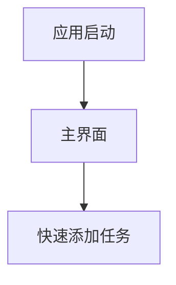

# Windows桌面待办事项应用产品需求文档

## 1. 产品概述

本产品是一款轻量级的Windows桌面待办事项管理应用，专为Windows 10和Windows 11用户设计。应用采用Tauri + React技术栈开发，具有简约精美的界面设计、多套主题选择和极低的性能消耗。

产品旨在为用户提供简单高效的任务管理工具，帮助用户快速记录、管理和完成日常待办事项，提升工作和生活效率。

目标是打造一款体积小巧、启动迅速、界面美观的桌面应用，满足用户对轻量级生产力工具的需求。

## 2. 核心功能

### 2.1 用户角色

本应用为单用户桌面应用，无需用户注册或登录，所有数据存储在本地。

### 2.2 功能模块

我们的待办事项应用包含以下主要页面：

1. **主界面**：任务列表展示、快速添加任务、任务状态切换
2. **任务详情页**：任务详细信息编辑、优先级设置、截止日期管理
3. **设置页面**：主题切换、应用偏好设置、数据管理

### 2.3 页面详情

| 页面名称  | 模块名称  | 功能描述                         |
| ----- | ----- | ---------------------------- |
| 主界面   | 任务列表  | 显示所有待办事项，支持按状态筛选（待完成、已完成、全部） |
| 主界面   | 快速添加  | 提供输入框快速添加新任务，支持回车键确认         |
| 主界面   | 任务操作  | 支持标记完成、编辑、删除任务等操作            |
| 主界面   | 状态统计  | 显示任务完成进度和统计信息                |
| 任务详情页 | 任务编辑  | 编辑任务标题、描述、优先级和截止日期           |
| 任务详情页 | 优先级管理 | 设置任务优先级（高、中、低）并用颜色区分         |
| 任务详情页 | 日期管理  | 设置任务截止日期和提醒时间                |
| 设置页面  | 主题切换  | 提供男性风格和女性风格两套主题选择            |
| 设置页面  | 应用设置  | 配置启动选项、通知设置等应用偏好             |
| 设置页面  | 数据管理  | 支持数据导出、导入和清空功能               |

## 3. 核心流程

用户打开应用后直接进入主界面，可以查看当前所有待办事项。用户可以通过快速添加功能创建新任务，点击任务可以进入详情页进行编辑。在设置页面，用户可以切换喜欢的主题风格并调整应用配置。

