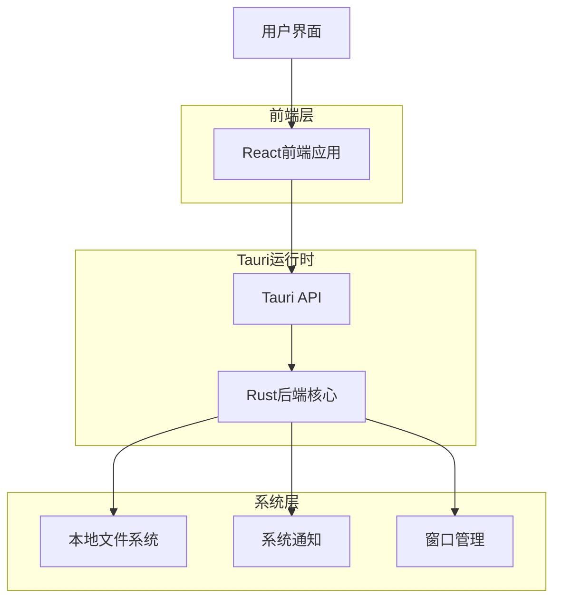
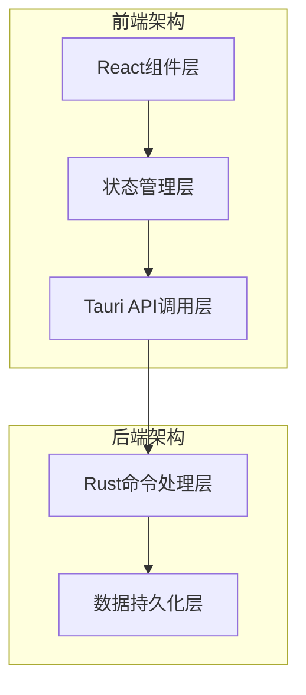
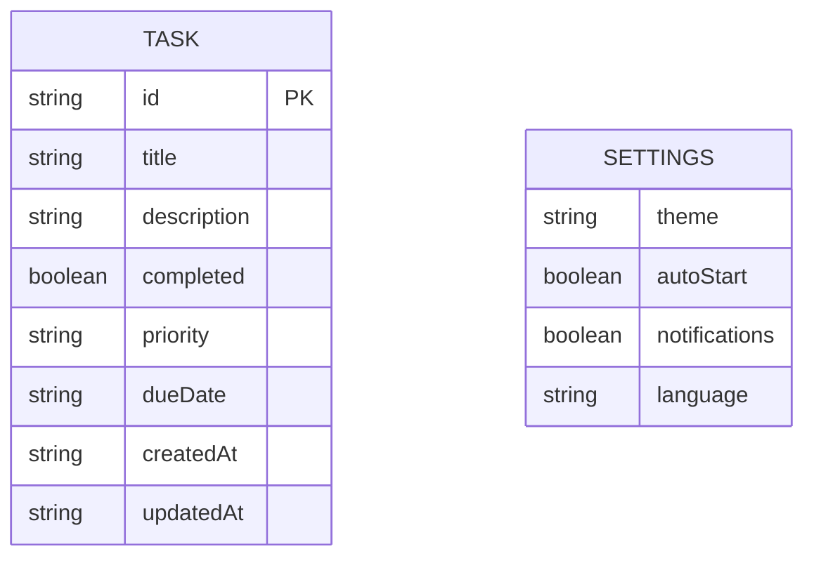

# Windows桌面待办事项应用技术架构文档

## 1. 架构设计



## 2. 技术描述

* 前端：React\@18 + TypeScript + Tailwind CSS + Vite

* 后端：Tauri\@1.5 + Rust

* 数据存储：本地JSON文件存储

* 构建工具：Vite + Tauri CLI

## 3. 路由定义

| 路由        | 用途                |
| --------- | ----------------- |
| /         | 主界面，显示任务列表和快速添加功能 |
| /task/:id | 任务详情页，编辑特定任务的详细信息 |
| /settings | 设置页面，主题切换和应用配置    |

## 4. API定义

### 4.1 核心API

任务管理相关

```
[Tauri Command] get_tasks
```

请求：无参数

响应：

| 参数名称  | 参数类型    | 描述     |
| ----- | ------- | ------ |
| tasks | Task\[] | 任务列表数组 |

示例

```json
{
  "tasks": [
    {
      "id": "1",
      "title": "完成项目文档",
      "description": "编写技术文档和用户手册",
      "completed": false,
      "priority": "high",
      "dueDate": "2024-01-15",
      "createdAt": "2024-01-10T10:00:00Z"
    }
  ]
}
```

```
[Tauri Command] create_task
```

请求：

| 参数名称        | 参数类型   | 是否必需  | 描述                   |
| ----------- | ------ | ----- | -------------------- |
| title       | string | true  | 任务标题                 |
| description | string | false | 任务描述                 |
| priority    | string | false | 优先级（high/medium/low） |
| dueDate     | string | false | 截止日期                 |

响应：

| 参数名称    | 参数类型    | 描述      |
| ------- | ------- | ------- |
| success | boolean | 操作是否成功  |
| task    | Task    | 创建的任务对象 |

```
[Tauri Command] update_task
```

请求：

| 参数名称    | 参数类型          | 是否必需 | 描述     |
| ------- | ------------- | ---- | ------ |
| id      | string        | true | 任务ID   |
| updates | Partial<Task> | true | 要更新的字段 |

响应：

| 参数名称    | 参数类型    | 描述     |
| ------- | ------- | ------ |
| success | boolean | 操作是否成功 |

```
[Tauri Command] delete_task
```

请求：

| 参数名称 | 参数类型   | 是否必需 | 描述       |
| ---- | ------ | ---- | -------- |
| id   | string | true | 要删除的任务ID |

响应：

| 参数名称    | 参数类型    | 描述     |
| ------- | ------- | ------ |
| success | boolean | 操作是否成功 |

主题和设置相关

```
[Tauri Command] get_settings
```

请求：无参数

响应：

| 参数名称          | 参数类型    | 描述                |
| ------------- | ------- | ----------------- |
| theme         | string  | 当前主题（male/female） |
| autoStart     | boolean | 是否开机自启            |
| notifications | boolean | 是否启用通知            |

```
[Tauri Command] update_settings
```

请求：

| 参数名称     | 参数类型              | 是否必需 | 描述     |
| -------- | ----------------- | ---- | ------ |
| settings | Partial<Settings> | true | 要更新的设置 |

响应：

| 参数名称    | 参数类型    | 描述     |
| ------- | ------- | ------ |
| success | boolean | 操作是否成功 |

## 5. 服务器架构图



## 6. 数据模型

### 6.1 数据模型定义



### 6.2 数据定义语言

任务数据结构 (Task)

```typescript
interface Task {
  id: string;
  title: string;
  description?: string;
  completed: boolean;
  priority: 'high' | 'medium' | 'low';
  dueDate?: string;
  createdAt: string;
  updatedAt: string;
}
```

设置数据结构 (Settings)

```typescript
interface Settings {
  theme: 'male' | 'female';
  autoStart: boolean;
  notifications: boolean;
  language: 'zh-CN' | 'en-US';
}
```

本地存储文件结构

```json
// tasks.json
{
  "tasks": [
    {
      "id": "uuid-string",
      "title": "任务标题",
      "description": "任务描述",
      "completed": false,
      "priority": "high",
      "dueDate": "2024-01-15",
      "createdAt": "2024-01-10T10:00:00Z",
      "updatedAt": "2024-01-10T10:00:00Z"
    }
  ]
}

// settings.json
{
  "theme": "male",
  "autoStart": false,
  "notifications": true,
  "language": "zh-CN"
}
```

Rust后端数据结构

```rust
#[derive(Serialize, Deserialize, Clone)]
struct Task {
    id: String,
    title: String,
    description: Option<String>,
    completed: bool,
    priority: Priority,
    due_date: Option<String>,
    created_at: String,
    updated_at: String,
}

#[derive(Serialize, Deserialize, Clone)]
enum Priority {
    High,
    Medium,
    Low,
}

#[derive(Serialize, Deserialize, Clone)]
struct Settings {
    theme: Theme,
    auto_start: bool,
    notifications: bool,
    language: String,
}

#[derive(Serialize, Deserialize, Clone)]
enum Theme {
    Male,
    Female,
}
```

